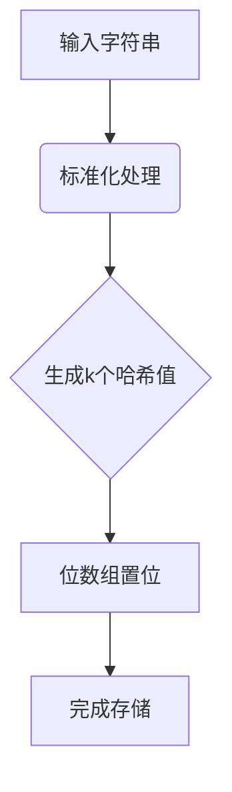

# SQLInjectionBloomFilter 算法设计与实现

## 1. 数学原理

### 1.1 布隆过滤器参数定义
令位数组大小为$m$，哈希函数数量为$k$，预期存储元素数量为$n$，则误判率$\epsilon$可表示为：

$$\epsilon ≈ (1 - e^{-kn/m})^k$$

### 1.2 参数优化
当$k = \frac{m}{n} \ln 2$时，获得最小误判率：

$$m = -\frac{n \ln\epsilon}{(\ln 2)^2}$$

### 1.3 参数计算实例
假设存储n=1,000,000个SQL注入模式，期望误判率≤0.1%：

$$m = -\frac{10^6 \times \ln(0.001)}{(\ln 2)^2} ≈ 14,378,341 \text{ bits} ≈ 1.72\text{MB}$$

取整为2^24位(16,777,216 bits)，此时实际哈希函数数量：

$$k = \lceil \frac{16,777,216}{10^6} \ln2 \rceil = 12$$

## 2. 实现架构

```python
class SQLInjectionBloomFilter:
    def __init__(self, capacity=1000000, error_rate=0.001):
        self.size = self.calculate_size(capacity, error_rate)
        self.hash_count = self.calculate_hash_count(capacity)
        self.bit_array = bitarray(self.size)

    # MurmurHash3 实现见第3节
    def _hash(self, item, seed):
        ...
```

## 3. MurmurHash3实现
```python
def _hash(self, item: str, seed: int) -> int:
    """32位MurmurHash3算法实现"""
    data = item.encode('utf-8')
    h = seed
    remainder = len(data) & 3
    bytes_len = len(data) - remainder
    for i in range(0, bytes_len, 4):
        k = int.from_bytes(data[i:i+4], 'little')
        k = (k * 0xcc9e2d51) & 0xFFFFFFFF
        k = ((k << 15) | (k >> 17)) & 0xFFFFFFFF
        k = (k * 0x1b873593) & 0xFFFFFFFF
        h ^= k
        h = ((h << 13) | (h >> 19)) & 0xFFFFFFFF
        h = (h * 5 + 0xe6546b64) & 0xFFFFFFFF
    # 处理剩余字节...
    return h % self.size
```

## 4. 复杂度分析
| 指标       | 计算公式            | 示例值(n=1M) |
|------------|---------------------|-------------|
| 空间复杂度 | O(m)               | 1.72MB      |
| 插入时间复杂度 | O(k)          | 12次哈希    |
| 查询时间复杂度 | O(k)          | 12次哈希    |

## 5. 字符串到位数组转换算法

### 5.1 转换流程


### 5.2 核心步骤
1. **输入预处理**：
   ```python
   def _normalize_input(self, input_str):
       # URL解码
       decoded = urllib.parse.unquote(input_str)
       # 移除注释
       cleaned = re.sub(r'--.*|#.*|\/\*.*?\*\/', '', decoded)
       # 统一大小写
       return cleaned.upper()
   ```

2. **多哈希生成**：
   ```python
   def _get_hash_values(self, item):
       return [
           (hash1 + i * hash2) % self.bit_size
           for i in range(self.num_hash_functions)
       ]
   ```

3. **位数组操作**：
   ```python
   def add(self, item):
       for bit_pos in self._get_hash_values(item):
           self.redis_client.setbit(self.key, bit_pos, 1)
   ```

### 5.3 数学验证
当插入元素$x$时，对于每个哈希函数$h_i$，位数组位置$h_i(x)$被置1。查询时若所有$h_i(x)$位为1，则判定可能存在。

误判概率计算：
$$P_{false} = \left(1 - e^{-kn/m}\right)^k$$

（文档内容持续建设中...）
